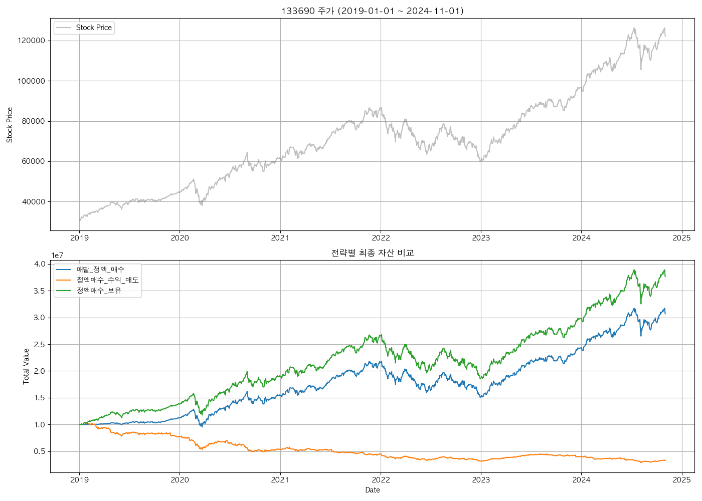

# 투자를 위한 간단한 백테스팅



이 프로젝트는 과거 주식 데이터를 사용하여 다양한 투자 전략을 백테스팅하기 위한 간단한 프레임워크를 제공합니다. `FinanceDataReader` 라이브러리를 사용하여 주식 데이터를 가져오고 몇 가지 기본적인 거래 전략을 구현하며 결과를 시각화합니다.

## 프로젝트 구조

*   `src/invest_backtesting/main.py`: 주식 데이터를 가져오고, 선택한 거래 전략을 시뮬레이션하며, 결과를 CSV 파일과 플롯으로 저장하는 메인 스크립트입니다.
*   `src/invest_backtesting/strategies.py`: 다양한 투자 전략(예: 매월 고정 수량 매수, 수익률 기반 매도)을 구현한 모듈입니다.
*   `src/invest_backtesting/plotting.py`: 백테스팅 결과를 시각화하고 플롯을 이미지 파일로 저장하는 함수를 포함합니다.
*   `src/invest_backtesting/plot_gdp.py`: 최근 GDP 성장률 데이터를 시각화하는 별도의 스크립트입니다. (메인 백테스팅 로직과는 무관)
*   `data/`: 백테스팅 결과 CSV 파일과 생성된 플롯 이미지를 저장하는 디렉토리입니다.

## 기능

*   **데이터 가져오기**: `FinanceDataReader`를 사용하여 지정된 종목과 기간의 과거 주식 데이터를 자동으로 다운로드합니다.
*   **거래 전략**: 다음 거래 전략의 구현을 포함합니다.
    *   `매달_정액_매수`: 매달 (또는 매주) 첫 거래일에 고정된 수량(현재 1주)을 매수합니다.
    *   `정액매수_수익_매도`: 매달 (또는 매주) 고정된 금액을 투자하고, 특정 수익률 기준에 도달하면 포지션을 매도합니다.
    *   `정액매수_보유`: 매달 (또는 매주) 고정된 금액을 투자하고, 구매한 주식을 보유합니다.
*   **사용자 정의 가능한 파라미터**: 명령줄 옵션을 통해 주식 코드, 백테스팅 시작 및 종료 날짜를 지정할 수 있습니다.
*   **출력**: 백테스팅 결과를 CSV 파일로 저장합니다.
*   **시각화**: 주가 대비 선택한 전략들의 성과를 비교하는 플롯을 생성하여 PNG 파일로 저장합니다.
*   **전략 선택**: 사용자는 명령줄 옵션을 통해 하나 또는 여러 전략을 선택하여 백테스팅할 수 있습니다.

## 설치

1.  저장소 복제:

    ```bash
    git clone https://github.com/fkt20/invest-backtesting.git
    cd invest-backtesting
    ```

2.  필수 종속성 설치:

    ```bash
    uv sync
    ```

## 사용법

`uv run` 명령어를 사용하여 백테스팅 스크립트를 실행합니다.

```bash
uv run backtesting [OPTIONS]
```

### 예시

1.  **도움말 보기**:

    ```bash
    uv run backtesting --help
    ```

2.  **기본값으로 실행 (KODEX 200)**:

    ```bash
    uv run backtesting
    ```

3.  **특정 종목과 기간으로 실행 (TIGER 나스닥100)**:

    ```bash
    uv run backtesting --stock_code 379800 --start_date 2021-01-01 --end_date 2024-06-30
    ```

4.  **특정 전략만 선택하여 실행**:

    ```bash
    uv run backtesting -st 매달_정액_매수 -st 정액매수_보유
    ```

### 추가 예정 사항

*   [ ] 더 정교한 거래 전략 구현.
*   [ ] 전략 파라미터 (예: 투자 금액, 수익률 기준) 사용자 정의 옵션 추가.
*   [ ] 성과 지표 (예: 샤프 지수, 최대 낙폭) 포함.
*   [ ] 다양한 시간 빈도 (일별, 주별) 백테스팅 허용.
*   [ ] 여러 종목 포트폴리오 백테스팅 구현.